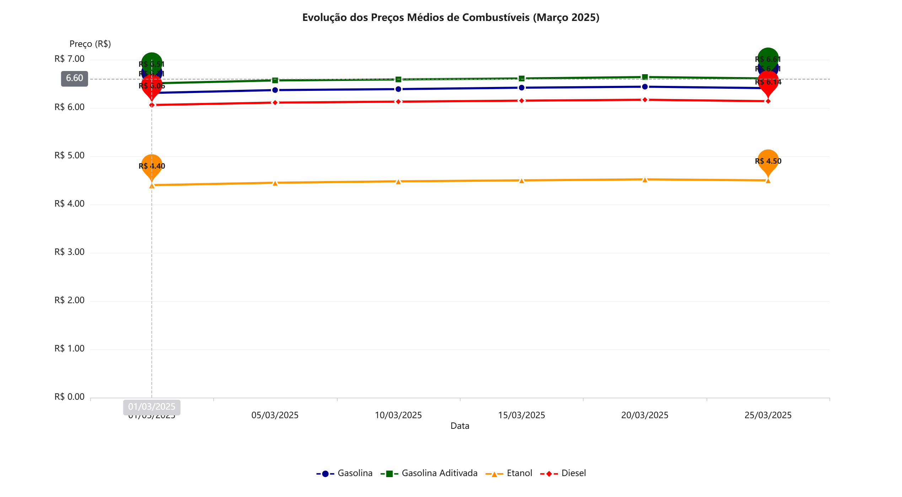
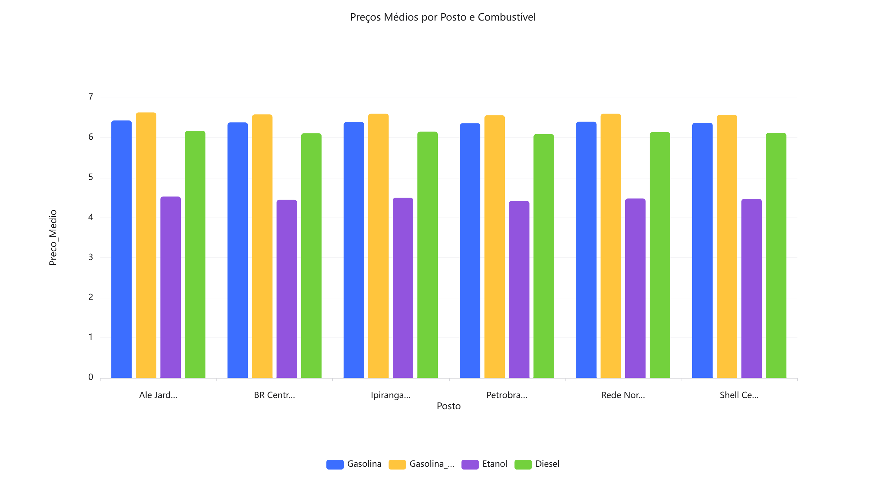

# Projeto de Extensão – Monitoramento de Preços de Combustíveis

**Aluno:** Luiz Gustavo Mattos de Martins Souza  
**Disciplina:** Arquitetura de Dados Relacionais I  
**Cidade:** Vila Velha/ES  
**Data:** Março 2026

## Objetivo
Criar um banco de dados para monitorar preços de combustíveis em 6 postos da cidade e disponibilizar os resultados para a população.

## Arquivos do Projeto
- [📄 Projeto Completo (todas as AOPs)](Projeto_Completo_Monitoramento_Combustiveis_Luiz_Gustavo.pdf)

## Gráficos

**Gráfico 1** – Evolução do Preço Médio dos 4 combustíveis  

**Gráfico 2** – Evolução da Gasolina por Posto  

## Planilha Completa
[📊 Acesse a planilha completa aqui](https://1drv.ms/x/c/16665af2b3acc34d/IQBKQYu4cVxLSL0cPxCSAgsMAfPRqEKp5vJEtmAwMXxuDeE?e=Hcbjkg)

## Como usar
1. Baixe o PDF completo  
2. Abra a planilha  
3. Compare os preços

Feito com ❤️ por Luiz Gustavo
